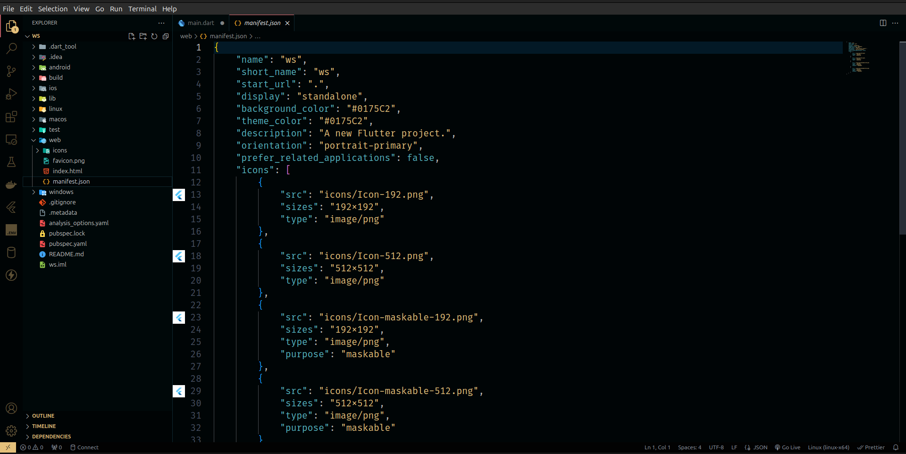

# [Monokai Dark Gold](https://github.com/adham-coding/monokai-dark-gold)

[](https://marketplace.visualstudio.com/items?itemName=adham-coding.monokai-dark-gold) [](https://marketplace.visualstudio.com/items?itemName=adham-coding.monokai-dark-gold) [](https://marketplace.visualstudio.com/items?itemName=adham-coding.monokai-dark-gold)

A darker variation of One Dark Pro theme for Visual Studio Code, with Monokai code coloring.

## Installation

Press `ctrl/command + shift + p` to launch the command palette, then run:
```
ext install adham-coding.monokai-dark-gold
```

### You can author your README using Visual Studio Code. Here are some useful editor keyboard shortcuts:

* Split the editor (`Cmd+\` on macOS or `Ctrl+\` on Windows and Linux).
* Toggle preview (`Shift+Cmd+V` on macOS or `Shift+Ctrl+V` on Windows and Linux).
* Press `Ctrl+Space` (Windows, Linux, macOS) to see a list of Markdown snippets.

## Screenshots




## Todo List

See [GitHub Projects](https://github.com/adham-coding/monokai-dark-gold/projects) for more.


## Requirements

* Visual Studio Code (http://code.visualstudio.com/)


## License

Apache 2.0, for further details, please see [LICENSE](https://github.com/adham-coding/monokai-dark-gold/blob/main/LICENSE) file


## Contributing

See [contributors.md](https://github.com/adham-coding/monokai-dark-gold/blob/main/contributors.md)

It is publicly open for any contribution. Bugfixes, new features and extra modules are welcome.

* To contribute to code: Fork the repo, push your changes to your fork, and submit a pull request.
* To report a bug: If something does not work, please report it using [GitHub Issues](https://github.com/adham-coding/monokai-dark-gold/issues).


## To Support

[Visit my patreon profile at patreon.com/adham-coding](https://www.patreon.com/adham-coding)
